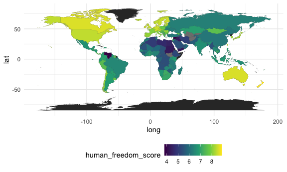

Cleaned Data & Maps
================

Cleaning datasets

``` r
whr_df = 
  read_excel("./data/WHR20_Data.xls") %>% 
  janitor::clean_names() %>% 
  arrange(country_name) %>% 
  rename(countries = country_name) %>% 
  select(-regional_indicator, -standard_error_of_ladder_score, -upperwhisker, -lowerwhisker)

hfi_df = 
  read_excel("./data/human-freedom-index-2019.xlsx",
             skip = 4, na = "-") %>% 
  janitor::clean_names() %>% 
  filter(year == "2017") %>% 
  arrange(countries) %>% 
  select(countries, human_freedom_score, procedural_justice:personal_freedom_score, government_consumption:economic_freedom_score)
```

Merging datasets

``` r
merged_df = 
  full_join(whr_df, hfi_df, by = "countries") %>% 
  select(countries, ladder_score, human_freedom_score, personal_freedom_score, economic_freedom_score, 
         religion, association, assembly, movement, inheritance_rights, security_safety, 
         disapperances_conflicts_and_terrorism, rule_of_law, homicide, size_of_government)

write.csv(merged_df, "./data/merged_df.csv")
```

First attempt at making a world map

``` r
world = 
  map_data("world")

whr_map =
  merged_df %>% 
  select(countries, ladder_score)


ggplot()+
  geom_map(data = world, map = world, aes(x = long, y = lat, group = group, map_id = region))+
  geom_map(data = whr_map, map = world, aes(fill = ladder_score, map_id = countries))
```

    ## Warning: Ignoring unknown aesthetics: x, y


``` r
hfi_map = 
  merged_df %>% 
  select(countries, human_freedom_score)

ggplot()+
  geom_map(data = world, map = world, aes(x = long, y = lat, group = group, map_id = region))+
  geom_map(data = hfi_map, map = world, aes(fill = human_freedom_score, map_id = countries))
```

    ## Warning: Ignoring unknown aesthetics: x, y



These maps have a couple of flaws:  
1\. Not interactive  
2\. Some of the country names do not match with the way they are written
in the world map data, so need to recode different country names in one
of the two datasets  
3\. They’re cute but not THAT cute

Thoughts/ideas:  
\- I believe there are some interactive tools (shiny, plotly) that we
could use, but we need to have the longitude and latitude information
for the countries in our dataset to build some of the maps that I
encountered in my search. Should consider merging the world dataset in
with ours (once country names match) for the map so that is not an
issue.  
\- Could look into using leaflet. I spent a bit of time examining but
was not able to find anything useful. There are some projections, but
the code looks complex and I am not sure what the best mechanism is for
this.  
\- Tried using plotly, was very slow to process and giving me an error
(Error: vector memory exhausted(limit reached?)) that I believe is
related to the amount of memory being asked for by plotly from my
computer, so, yeah, not great.

Things to add: - html website creation - video creation - linear
regression - nordic exceptionalism subanalysis
