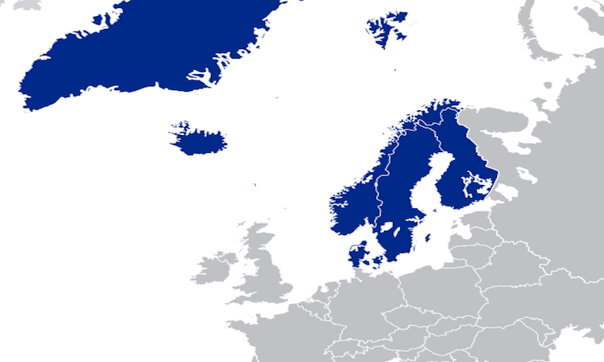

```{r setup, include = FALSE}
library(tidyverse)
library(readxl)
library(patchwork)
library(ggrepel)

knitr::opts_chunk$set(
  fig.width = 6,
  fig.asp = .6,
  out.width = "90%"
)

theme_set(theme_minimal() + theme(legend.position = "bottom"))

options(
  ggplot2.continuous.colour = "viridis",
  ggplot2.continuous.fill = "viridis"
)

scale_colour_discrete = scale_colour_viridis_d
scale_fill_discrete = scale_fill_viridis_d
```



(Add info on idea of "nordic exceptionalism" and outline of anaylsis/exploration) The Nordic Region includes five countries: Denmark, Norway, Sweden, Finland, and Iceland. 

## Comparing Nordic Countries' Happiness and Freedom Scores 

```{r, warning = FALSE, message = FALSE}
# Creating Nordic only dataset
nordic_only = 
  read_csv("./data/merged_df.csv") %>% 
  filter(countries %in% c("Denmark", "Norway", "Sweden", 
           "Finland", "Iceland")) %>% 
  select(-X1) %>% 
  rename("overall_happiness_score" = "ladder_score")

# Creating dataset with all other countries
global_other = read_csv("./data/merged_df.csv") %>% 
  select(-X1) %>% 
  subset(countries != "Denmark" & countries != "Norway" & 
           countries != "Sweden" & countries != "Finland" & 
           countries != "Iceland") %>% 
  rename("overall_happiness_score" = "ladder_score")

#Getting averages across dataframes
nordic_averages = summarise_all(nordic_only, mean)
global_averages = summarise_all(global_other, mean, na.rm = TRUE)

#Removing NAs in 'countries' from last step 
nordic_averages[is.na(nordic_averages)] = 0
global_averages[is.na(global_averages)] = 1

#Binding dataframes                          
nordic_compare = 
  rbind(nordic_only, nordic_averages, global_averages) %>% 
  mutate(
    countries = as.character(countries),
    countries = 
      str_replace(countries, "0", "nordic_avg"),
    countries = 
      str_replace(countries, "1", "other_global_avg")
    )
```

The below table demonstrates happiness and freedom scores for the five Nordic countries. The human freedom score is a composite of the economic and social freedom measurements. We can also compare these to the average scores for the all other countries in the world.  

```{r, warning = FALSE, message = FALSE}
nordic_compare %>% 
  select(countries, overall_happiness_score, human_freedom_score, 
         personal_freedom_score, economic_freedom_score) %>% 
  knitr::kable()
```

The below table demonstrates measures of selected indicators that contribute to the economic and personal freedome scores. We compare these indicators across Nordic countries, as well as to averages from the rest of the world.

Definitions for this indicators can be found in our "About" page, under "HFI Indicators Defined". 

```{r, warning = FALSE, message = FALSE}
nordic_compare %>% 
  select(countries, religion, association, assembly, rule_of_law, homicide, disapperances_conflicts_and_terrorism, inheritance_rights, size_of_government) %>%
  knitr::kable()
```


```{r}
nordic_compare %>% 
  subset(countries != "nordic_avg") %>% 
  ggplot(aes(x = human_freedom_score, y = overall_happiness_score)) + 
  geom_point(aes(color = countries), show.legend = FALSE) + 
  geom_text_repel(aes(label = countries)) +
  ylim (min = 0, max = 10) + 
  xlim (min = 0, max = 10) + 
  theme(legend.position = "right",
        title = element_text(size = 9)) + 
  labs(
    title = "Comparing freedom and happiness scores within Nordic region and to mean scores for all other countries",
    y = "overall happiness score",
    x = "human freedom score"
  )
```


```{r, warning = FALSE, message = FALSE}
nordic_compare %>% 
  select(-overall_happiness_score) %>% 
  pivot_longer(
    human_freedom_score:size_of_government,
    names_to = "freedom_subgroup",
    values_to = "score"
  ) %>% 
  filter(str_detect(freedom_subgroup, 
                    "religion|rule_of_law|homicide|size_of_government")) %>% 
  mutate(
    freedom_subgroup = 
           fct_relevel(freedom_subgroup,
                       "religion", "rule_of_law", "homicide",
                       "size_of_government"),
    countries = 
      fct_relevel(countries, 
                  "Denmark", "Finland", "Iceland", "Norway", "Sweden", "nordic_avg", "other_global_avg")
    ) %>% 
  ggplot(aes(x = countries, y = score, fill = freedom_subgroup)) + 
  geom_bar(stat = "identity", color = "black",
           position = position_dodge()) +
  ylim(min = 0, max = 10) + 
  labs(
    title = "Average scores of indicators from freedoms sub-categories among Nordic and all other countries"
  )
```

## Statistical Testing: Nordic region vs Other countries

Notably, we lack data on the variance within country measures in the original datasets, limiting our ability to conduct an ANOVA test and see if the any one of the Nordic countries' mean happiness and freedom scores significantly differed from the others. 

We carried out a two-sample t-test to see whether the mean differences for overall happiness and freedom scores between Nordic countries and the rest of the world are statistically significant. 
```{r, warning = FALSE, message = FALSE}

#Reformatting data for tests and some visuals

merged_setup = read_csv("./data/merged_df.csv") %>% 
  select(-X1) %>% 
  rename("overall_happiness_score" = "ladder_score") %>%
  select(countries, overall_happiness_score,
         human_freedom_score) %>% 
  mutate(
    countries = case_when(
      countries == "Denmark"     ~ "nordic",
      countries == "Norway"      ~ "nordic",
      countries == "Sweden"      ~ "nordic",
      countries == "Finland"     ~ "nordic",
      countries == "Iceland"     ~ "nordic"
    )) %>% 
  mutate(countries = as.character(countries))

merged_setup$countries[is.na(merged_setup$countries)] = "other"

```

Comparing mean happiness and freedom scores between Nordic and all other countries:
```{r, warning = FALSE, message = FALSE}
plot_freedom = 
  merged_setup %>% 
  ggplot(aes(y = human_freedom_score, 
             x = countries,
             fill = countries)) + 
  geom_boxplot(stat = "boxplot", show.legend = FALSE) + 
  labs(y = "human freedom score") + 
  ylim(min = 0, max = 10)

plot_happy = 
  merged_setup %>% 
  ggplot(aes(y = overall_happiness_score, 
             x = countries,
             fill = countries)) + 
  geom_boxplot(stat = "boxplot", show.legend = FALSE) + 
  labs(y = "overall happiness score") +
  ylim(min = 0, max = 10)

plot_happy | plot_freedom
```

```{r, include = FALSE}
#Group means, counts, and SD for happiness score
merged_setup %>% 
  group_by(countries) %>%
  summarise(
    count = n(),
    mean = mean(overall_happiness_score, na.rm = TRUE),
    sd = sd(overall_happiness_score, na.rm = TRUE)
  ) %>% 
  knitr::kable()

#Group means, counts, and SD for freedom score
merged_setup %>% 
  group_by(countries) %>%
  summarise(
    count = n(),
    mean = mean(human_freedom_score, na.rm = TRUE),
    sd = sd(human_freedom_score, na.rm = TRUE)
  ) %>% 
  knitr::kable()
```

### Checking assumption of group variance homogeneity

```{r, warning = FALSE, message = FALSE}
res.ftest = var.test(overall_happiness_score ~ countries, data = merged_setup)

print(res.ftest)
```

* When checking the variance in Nordic versus all other countries happiness scores, the p-value of <0.05 in the output above indicates that our group variances are significantly different and we cannot assume equal variance in the t-test. 

```{r, warning = FALSE, message = FALSE}
res.ftest = var.test(human_freedom_score ~ countries, data = merged_setup)

print(res.ftest)
```

* When checking the variance in Nordic versus all other countries freedom scores, the p-value of <0.05 in the output above indicates that our group variances are significantly different and we cannot assume equal variance in the t-test. 

### Two sample t-test 

Results from two sample t-test comparing overall happiness in Nordic vs other countries:  
```{r, warning = FALSE, message = FALSE}
t.test(overall_happiness_score ~ countries, 
       data = merged_setup, var.equal = FALSE) %>% 
  broom::tidy() %>% 
  select(estimate, statistic, p.value) %>% 
  knitr::kable()
```

Results from two sample t-test comparing human freedom in Nordic vs other countries: 
```{r, warning = FALSE, message = FALSE}
t.test(human_freedom_score ~ countries,
       data = merged_setup, var.equal = FALSE) %>% 
  broom::tidy() %>% 
  select(estimate, statistic, p.value) %>% 
  knitr::kable()
```

According to the above resutls, we have sufficient evidence to say that mean citizen happiness in Nordic countries is significantly different from the rest of the world. And that mean human freedom in Nordic countries is significantly difference from the rest of the world. 

These results should be interpreted with caution. ******(likely underpowered)