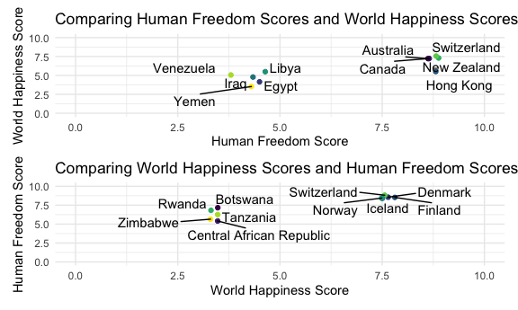

Top 5 Countries
================

## Read in data

``` r
merged_df = 
  read_csv("./data/merged_df.csv") %>% 
  mutate(world_happiness_score = ladder_score) %>% 
  select(-X1, -ladder_score) %>% 
  drop_na(world_happiness_score, human_freedom_score) %>% 
  select(countries, world_happiness_score, everything())
```

## Ladder Score Bottom 5

``` r
bot5_whr = 
  merged_df %>% 
  arrange(world_happiness_score) %>% 
  top_n(world_happiness_score, n = -5)
```

## Ladder Score Top 5

``` r
top5_whr = 
  merged_df %>% 
  arrange(world_happiness_score) %>% 
  top_n(world_happiness_score, n = 5) %>% 
  arrange(desc(world_happiness_score))
```

## HFI Top 5

``` r
top5_hfi = 
  merged_df %>% 
  select(countries, human_freedom_score, everything()) %>% 
  arrange(human_freedom_score) %>% 
  top_n(human_freedom_score, n = 5) %>% 
  arrange(desc(human_freedom_score))
```

## HFI Bottom 5

``` r
bot5_hfi = 
  merged_df %>% 
  select(countries, human_freedom_score, everything()) %>%
  arrange(human_freedom_score) %>% 
  top_n(human_freedom_score, n = -5)
```

## Tables n Plots

``` r
bot5_hfi %>% knitr::kable()
```

| countries | human\_freedom\_score | world\_happiness\_score | personal\_freedom\_score | economic\_freedom\_score | religion | association | assembly | movement | inheritance\_rights | security\_safety | disapperances\_conflicts\_and\_terrorism | rule\_of\_law | homicide | size\_of\_government |
| :-------- | --------------------: | ----------------------: | -----------------------: | -----------------------: | -------: | ----------: | -------: | -------: | ------------------: | ---------------: | ---------------------------------------: | ------------: | -------: | -------------------: |
| Venezuela |                  3.80 |                  5.0532 |                 5.027017 |                     2.58 | 6.884815 |        10.0 |     10.0 | 6.666667 |                10.0 |         6.316516 |                                 8.949547 |      2.060257 | 0.000000 |             4.578746 |
| Yemen     |                  4.30 |                  3.5274 |                 2.750150 |                     5.84 |       NA |          NA |       NA | 1.666667 |                 0.0 |         4.188703 |                                 1.179511 |      2.371872 | 7.336599 |             7.108343 |
| Iraq      |                  4.34 |                  4.7848 |                 3.467836 |                     5.21 | 5.327778 |         5.0 |      7.5 | 4.166667 |                 0.0 |         3.552739 |                                 0.000000 |      2.557224 | 6.058217 |             5.043282 |
| Egypt     |                  4.50 |                  4.1514 |                 3.946335 |                     5.05 | 3.733333 |         5.0 |      2.5 | 4.166667 |                 0.0 |         4.983010 |                                 5.304344 |      3.626148 | 8.994685 |             4.862935 |
| Libya     |                  4.64 |                  5.4888 |                 4.833050 |                     4.45 | 6.938889 |         2.5 |      2.5 | 5.833333 |                 7.5 |         6.891814 |                                 2.926994 |      2.321973 | 8.998449 |             3.654235 |

``` r
top5_hfi %>% knitr::kable()
```

| countries   | human\_freedom\_score | world\_happiness\_score | personal\_freedom\_score | economic\_freedom\_score | religion | association | assembly | movement | inheritance\_rights | security\_safety | disapperances\_conflicts\_and\_terrorism | rule\_of\_law | homicide | size\_of\_government |
| :---------- | --------------------: | ----------------------: | -----------------------: | -----------------------: | -------: | ----------: | -------: | -------: | ------------------: | ---------------: | ---------------------------------------: | ------------: | -------: | -------------------: |
| New Zealand |                  8.88 |                  7.2996 |                 9.269332 |                     8.50 | 9.731481 |        10.0 |     10.0 |       10 |                  10 |         9.906667 |                                10.000000 |      7.868546 |     9.72 |             6.635921 |
| Switzerland |                  8.82 |                  7.5599 |                 9.236934 |                     8.40 | 8.188519 |        10.0 |     10.0 |       10 |                  10 |         9.933333 |                                10.000000 |      8.272328 |     9.80 |             7.595275 |
| Hong Kong   |                  8.81 |                  5.5104 |                 8.700343 |                     8.91 | 8.592222 |         7.5 |      7.5 |       10 |                  10 |         9.960000 |                                10.000000 |      7.137817 |     9.88 |             8.192663 |
| Canada      |                  8.65 |                  7.2321 |                 9.222964 |                     8.08 | 9.003704 |        10.0 |     10.0 |       10 |                  10 |         9.747287 |                                 9.961861 |      7.738324 |     9.28 |             6.484464 |
| Australia   |                  8.62 |                  7.2228 |                 9.160533 |                     8.07 | 9.075926 |        10.0 |     10.0 |       10 |                  10 |         9.878339 |                                 9.955017 |      7.776279 |     9.68 |             6.959863 |

``` r
hfi_combo = full_join(bot5_hfi, top5_hfi)
```

    ## Joining, by = c("countries", "human_freedom_score", "world_happiness_score", "personal_freedom_score", "economic_freedom_score", "religion", "association", "assembly", "movement", "inheritance_rights", "security_safety", "disapperances_conflicts_and_terrorism", "rule_of_law", "homicide", "size_of_government")

``` r
hfi_plot = 
  hfi_combo %>% 
  ggplot(aes(x = human_freedom_score, y = world_happiness_score))+
  geom_point()+
  geom_label(aes(label = countries), hjust = 0, vjust = 0)+
  xlim(min = 0, max = 10)+
  ylim(min = 0, max = 10)

bot5_whr %>% knitr::kable()
```

| countries                | world\_happiness\_score | human\_freedom\_score | personal\_freedom\_score | economic\_freedom\_score | religion | association | assembly | movement | inheritance\_rights | security\_safety | disapperances\_conflicts\_and\_terrorism | rule\_of\_law | homicide | size\_of\_government |
| :----------------------- | ----------------------: | --------------------: | -----------------------: | -----------------------: | -------: | ----------: | -------: | -------: | ------------------: | ---------------: | ---------------------------------------: | ------------: | -------: | -------------------: |
| Zimbabwe                 |                  3.2992 |                  5.65 |                 5.608024 |                     5.69 | 6.427778 |         2.5 |      2.5 | 6.666667 |                 7.5 |         8.360052 |                                 8.997580 |      3.507599 | 7.332577 |             5.491676 |
| Rwanda                   |                  3.3123 |                  6.82 |                 6.377693 |                     7.26 | 6.040370 |         2.5 |      2.5 | 8.333333 |                 7.5 |         8.568363 |                                 7.962867 |      5.388166 | 8.992223 |             5.248773 |
| Central African Republic |                  3.4759 |                  5.41 |                 5.592765 |                     5.23 | 8.288889 |         7.5 |     10.0 | 5.000000 |                 7.5 |         4.549016 |                                 4.000000 |      2.406486 | 2.097050 |             6.504289 |
| Tanzania                 |                  3.4762 |                  6.26 |                 5.748136 |                     6.77 | 6.447778 |         7.5 |      5.0 | 8.333333 |                 0.0 |         6.835967 |                                 8.487902 |      4.244131 | 7.520000 |             6.658225 |
| Botswana                 |                  3.4789 |                  7.17 |                 6.970084 |                     7.37 | 9.008333 |          NA |       NA | 7.500000 |                 7.5 |         7.578237 |                                10.000000 |      5.641684 | 3.984712 |             6.366563 |

``` r
top5_whr %>% knitr::kable()
```

| countries   | world\_happiness\_score | human\_freedom\_score | personal\_freedom\_score | economic\_freedom\_score | religion | association | assembly | movement | inheritance\_rights | security\_safety | disapperances\_conflicts\_and\_terrorism | rule\_of\_law | homicide | size\_of\_government |
| :---------- | ----------------------: | --------------------: | -----------------------: | -----------------------: | -------: | ----------: | -------: | -------: | ------------------: | ---------------: | ---------------------------------------: | ------------: | -------: | -------------------: |
| Finland     |                  7.8087 |                  8.53 |                 9.268558 |                     7.80 | 7.901482 |          10 |       10 |       10 |                  10 |         9.807725 |                                 9.903175 |      8.639248 |     9.52 |             4.711377 |
| Denmark     |                  7.6456 |                  8.56 |                 9.238444 |                     7.89 | 7.702222 |          10 |       10 |       10 |                  10 |         9.840000 |                                10.000000 |      8.687101 |     9.52 |             4.707251 |
| Switzerland |                  7.5599 |                  8.82 |                 9.236934 |                     8.40 | 8.188519 |          10 |       10 |       10 |                  10 |         9.933333 |                                10.000000 |      8.272328 |     9.80 |             7.595275 |
| Iceland     |                  7.5045 |                  8.41 |                 9.084634 |                     7.74 | 8.122222 |          10 |       10 |       10 |                  10 |         9.880000 |                                10.000000 |      7.757267 |     9.64 |             5.811087 |
| Norway      |                  7.4880 |                  8.44 |                 9.259625 |                     7.62 | 7.407407 |          10 |       10 |       10 |                  10 |         9.933333 |                                10.000000 |      8.556488 |     9.80 |             4.927812 |

``` r
whr_combo = full_join(bot5_whr, top5_whr)
```

    ## Joining, by = c("countries", "world_happiness_score", "human_freedom_score", "personal_freedom_score", "economic_freedom_score", "religion", "association", "assembly", "movement", "inheritance_rights", "security_safety", "disapperances_conflicts_and_terrorism", "rule_of_law", "homicide", "size_of_government")

``` r
whr_plot = 
  whr_combo %>% 
  ggplot(aes(x = world_happiness_score, y = human_freedom_score))+
  geom_point()+
  geom_label(aes(label = countries), hjust = 0, vjust = 0)+
  xlim(min = 0, max = 10)+
  ylim(min = 0, max = 10)

hfi_plot + whr_plot
```


